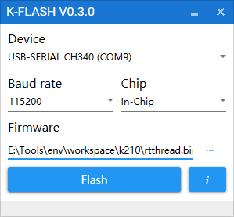
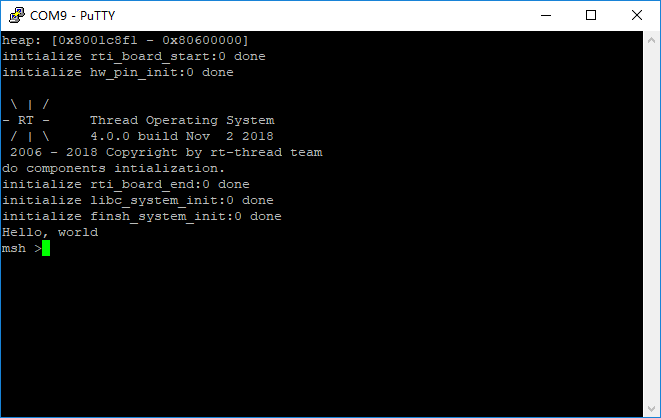

# 基于Rt-Thread的物联网网关平台设计
## 说明：

本项目采用Rtthread-Kendryte K210开发板进行构建，是一种依赖WIFI在局域网内部提供数据统计上报支持的物联网网关平台

## 配置方法：

前提：拥有一台可以正常访问的MQTT服务（阿里云、腾讯云、EMQT等皆可）

clone本项目到本地，随后使用Rt-Thread-Studio打开并构建。后前往[./applications/config/config.h](https://github.com/farewell12345/RTT-IotGateWay/blob/master/applications/config/config.h)中进行MQTT配置与Wifi配置

构建并使用[K-Flash](https://github.com/sipeed/kflash_gui/releases)烧录代码到板子中

上电运行，终端出现以下画面说明配置成功


可到[/applications/sever/sever.h](https://github.com/farewell12345/RTT-IotGateWay/blob/master/applications/sever/sever.h)配置网关路由，即可在启动后在局域网内向网关发送路由

以下为启动后监测网关路由是否正常启动的测试脚本（需在同一网络环境下测试，IP在网关连接WIFI后会在终端中自行打印，若失败，请检查你的配置）：

```
from random import random
from time import sleep

import requests

user_agent_list = [
    "Mozilla/5.0 (Windows NT 10.0; WOW64) AppleWebKit/537.36 (KHTML, like Gecko) Chrome/68.0.3440.106 Safari/537.36",
    "Mozilla/5.0 (Windows NT 10.0; WOW64) AppleWebKit/537.36 (KHTML, like Gecko) Chrome/67.0.3396.99 Safari/537.36",
    "Mozilla/5.0 (Windows NT 10.0; WOW64) Gecko/20100101 Firefox/61.0",
    "Mozilla/5.0 (Windows NT 10.0; WOW64) AppleWebKit/537.36 (KHTML, like Gecko) Chrome/64.0.3282.186 Safari/537.36",
    "Mozilla/5.0 (X11; Linux x86_64) AppleWebKit/537.36 (KHTML, like Gecko) Chrome/62.0.3202.62 Safari/537.36",
    "Mozilla/5.0 (Windows NT 6.1; WOW64) AppleWebKit/537.36 (KHTML, like Gecko) Chrome/45.0.2454.101 Safari/537.36",
    "Mozilla/4.0 (compatible; MSIE 7.0; Windows NT 6.0)",
    "Mozilla/5.0 (Macintosh; U; PPC Mac OS X 10.5; en-US; rv:1.9.2.15) Gecko/20110303 Firefox/3.6.15",
    ]
id = 2
IP = "192.168.0.102"
while True:
    try:
        requests.get(headers={'User-Agent': 'Mozilla/5.0 (Windows NT 10.0; Win64; x64) AppleWebKit/537.36 (KHTML, '
                                            'like Gecko) Chrome/103.0.0.0 Safari/537.36'},
                     url=f'http://{IP}/cgi-bin/device/post?id={id}&value=%d' % int(random() * 40))
        sleep(10)
    except Exception as e:
        print(e)
        sleep(2)
        continue
```

若有疑问，参阅下面的 Kendryte K210说明

# Kendryte K210板级支持包说明

## 1. 简介

Kendryte K210 是集成机器视觉与机器听觉能力的系统级芯片(SoC)。使用台积电 (TSMC) 超低功耗的 28 纳米先进制程，具有双核64位处理器，拥有较好的功耗性能，稳定性与可靠性。该方案力求零门槛开发，可在最短时效部署于用户的产品中，赋予产品人工智能。

Kendryte K210 定位于AI与IoT市场的SoC，同时是使用非常方便的MCU。

Kendryte中文含义为勘智，而勘智取自勘物探智。这颗芯片主要应用领域为物联网领域，在物联网领域进行开发，因此为勘物；这颗芯片主要提供的是人工智能解决方案，在人工智能领域探索，因此为探智。

* 具备机器视觉能力
* 具备机器听觉能力
* 更好的低功耗视觉处理速度与准确率
* 具备卷积人工神经网络硬件加速器KPU，可高性能进行卷积人工神经网络运算
* TSMC 28nm先进制程，温度范围-40°C到125°C，稳定可靠
* 支持固件加密，难以使用普通方法破解
* 独特的可编程IO阵列，使产品设计更加灵活
* 低电压，与相同处理能力的系统相比具有更低功耗
* 3.3V/1.8V双电压支持，无需电平转换，节约成本

芯片规格包括如下：

| 硬件 | 描述 |
| -- | -- |
|芯片型号| K210 |
|CPU| 双核RV64GC |
|主频| 400MHz |
|片内SRAM| 8MB |
| 外设 | 内嵌AES与SHA256算法加速器 |
| | DVP、JTAG、OTP、FPIOA、GPIO、UART、SPI、RTC、I²S、I²C、WDT、Timer与PWM |

## 2. 编译说明

编译 K210，需要有 RT-Thread 的代码，因为 K210 的 sdk 是以软件包方式，所以需要在 bsp/k210 下做软件包更新。注意，需要使用 latest 的 RT-Thread 源码和 Latest 的软件包，软件包在menuconfig中的配置路径如下:

```
RT-Thread online packages ---> peripheral libraries and drivers ---> kendryte K210 SDK package for rt-thread
```

最新的 k210 SDK 使用了 C++17 编写了部分代码，因此需要打开 C++ 组件，C++组件在menuconfig中的配置路径如下：

```
RT-Thread Components --->  C++ features
```

Windows下推荐使用[env工具][1]，然后在console下进入bsp/k210目录中，运行：

    cd bsp/k210
    menuconfig # 在软件包中选择最新的 k210 SDK
    pkgs --update

如果在Linux平台下，可以先执行

    scons --menuconfig

它会自动下载env相关脚本到~/.env目录，然后执行

    source ~/.env/env.sh
    
    cd bsp/k210
    pkgs --update
下载risc-v的工具链，[下载地址](https://github.com/xpack-dev-tools/riscv-none-embed-gcc-xpack/releases)  
    
更新完软件包后，在`rtconfig.py`中将risc-v工具链的本地路径加入文档。
注：  
1. 工具链建议使用上方提供的，`kendryte的官方工具链`会报浮点类型不兼容的错误，`risc-v工具链8.2.0之前的版本`会出现头文件不兼容的问题。
2. 网上传需要开启C++ 17,认为k210的神经网络编译器nncase多数语法由C++ 17,故需要开启C++ 17。个人认为没有必要，nncase是在PC端独立使用的，
作用是将神经网络模型转为kmodel格式，此格式文件为已经编译的二进制文件。（[shentalon](13212105191@163.com)注）  

然后执行scons编译：  

    set RTT_EXEC_PATH=your_toolchains
    scons

来编译这个板级支持包。如果编译正确无误，会产生rtthread.elf、rtthread.bin文件。其中rtthread.bin需要烧写到设备中进行运行。  
注：如果初次使用编译报错，可能是使用的SDK过老，使用`menuconfig`命令，在→ RT-Thread online packages → peripheral libraries 
and drivers → the kendryte-sdk package for rt-thread中将SDK改为latest版本即可。
## 3. 烧写及执行

连接好串口，然后使用[K-Flash](https://kendryte.com/downloads/)工具进行烧写bin文件。



### 3.1 运行结果

如果编译 & 烧写无误，当复位设备后，会在串口上看到RT-Thread的启动logo信息：



如果是K210-test_v0.2开发板，可以用如下命令来打开串口：

    python -m serial.tools.miniterm --rts 0 --dtr 0 COM9 115200

## 4. 驱动支持情况及计划

| 驱动 | 支持情况  |  备注  |
| ------ | ----  | :------:  |
| UART | 支持 | 高速UART，用于shell |

## 5. 联系人信息

维护人：[bernard](https://github.com/BernardXiong)

## 6. 注意事项

在进行系统menuconfig配置时，以下项是必选的

| 配置项 | 强制配置值 |
| -----  | --------- |
| Alignment size for CPU architecture data access | 8 |
| The stack size of idle thread | > 1024 |
| the device name for console | "uarths" |
| Set main thread stack size | 4096 |

## 7. 参考

* 芯片[datasheet][2]

  [1]: https://www.rt-thread.org/page/download.html
  [2]: https://s3.cn-north-1.amazonaws.com.cn/dl.kendryte.com/documents/kendryte_datasheet_20180919020633.pdf
